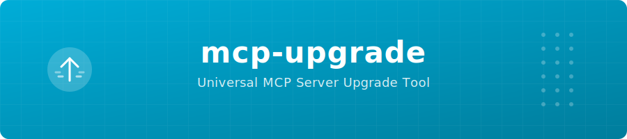

<p align="center">
  
</p>

# mcp-upgrade

Universal upgrade tool for [MCP](https://modelcontextprotocol.io/) (Model Context Protocol) servers across all AI coding clients and package ecosystems.

No AI coding client has built-in MCP server upgrade commands. `mcp-upgrade` fills that gap — it auto-discovers your servers, checks for updates, and upgrades them.

## Features

- **Auto-discovery** — finds MCP servers from Claude Code, Claude Desktop, Cursor, Windsurf, VS Code, Cline, Continue, Zed, and Codex CLI
- **Type detection** — infers whether each server is npm, pip, Go, Docker, or a GitHub release binary
- **Version checking** — queries npm, PyPI, GitHub Releases, and Docker Hub for latest versions
- **Upgrade execution** — upgrades servers using the appropriate package manager
- **Deduplication** — same binary referenced by multiple clients shows once
- **JSON output** — machine-readable output for scripting

## Install

### Homebrew

```bash
brew install GeiserX/mcp-upgrade/mcp-upgrade
```

### Go

```bash
go install github.com/GeiserX/mcp-upgrade@latest
```

### From releases

Download the binary for your platform from [Releases](https://github.com/GeiserX/mcp-upgrade/releases).

## Usage

### Scan

Discover all MCP servers across your installed clients:

```bash
mcp-upgrade scan
```

```
Found 3 client(s), 9 server(s)

Clients:
  Claude Code (~/.claude.json)
  Claude Code (~/.claude/settings.json)
  Cursor (~/.cursor/mcp.json)

┌──────────────────┬────────────────┬──────────────────────────────┬─────────────┐
│      SERVER      │      TYPE      │           PACKAGE            │   CLIENT    │
├──────────────────┼────────────────┼──────────────────────────────┼─────────────┤
│ github-personal  │ github-release │ -                            │ Claude Code │
│ pubmed           │ npx            │ @cyanheads/pubmed-mcp-server │ Claude Code │
│ atlassian        │ pipx           │ mcp-atlassian                │ Claude Code │
│ terraform        │ go-binary      │ -                            │ Claude Code │
│ jenkins          │ uvx            │ mcp-jenkins                  │ Claude Code │
│ kagisearch       │ docker         │ -                            │ Claude Code │
│ datadog          │ npx            │ @winor30/mcp-server-datadog  │ Claude Code │
└──────────────────┴────────────────┴──────────────────────────────┴─────────────┘
```

### Check

Check all servers for available updates:

```bash
mcp-upgrade check
```

```
  MCP Server Status

┌──────────────────┬────────────────┬─────────┬────────┬────────────┐
│      SERVER      │      TYPE      │ CURRENT │ LATEST │   STATUS   │
├──────────────────┼────────────────┼─────────┼────────┼────────────┤
│ atlassian        │ pipx           │ 0.21.0  │ 0.21.1 │ UPDATE     │
│ github-personal  │ github-release │ 0.31.0  │ v1.0.3 │ UPDATE     │
│ terraform        │ go-binary      │ 0.4.0   │ v0.5.1 │ UPDATE     │
│ jenkins          │ uvx            │ 0.11.7  │ 3.2.0  │ UPDATE     │
│ pubmed           │ npx            │ (auto)  │ 2.6.1  │ AUTO       │
│ datadog          │ npx            │ (auto)  │ 1.7.0  │ AUTO       │
│ kagisearch       │ docker         │ (local) │ latest │ AUTO       │
└──────────────────┴────────────────┴─────────┴────────┴────────────┘

  4 upgradable, 0 up-to-date, 3 auto-latest, 0 skipped
```

### Upgrade

Upgrade all outdated servers:

```bash
mcp-upgrade upgrade
```

Upgrade specific servers:

```bash
mcp-upgrade upgrade atlassian terraform
```

Dry run (show what would happen):

```bash
mcp-upgrade upgrade --dry-run
```

### JSON output

All commands support `--json` for scripting:

```bash
mcp-upgrade check --json | jq '.[] | select(.status == "UPDATE")'
```

## Supported server types

| Type | Detection | Version check | Upgrade method |
|------|-----------|---------------|----------------|
| **npx** | `npx -y <pkg>` command | npm registry | Clear npx cache |
| **pipx** | Binary in pipx venvs | PyPI API | `pipx upgrade` |
| **uvx** | `uvx <pkg>` command | PyPI API | `uv tool upgrade` |
| **go-binary** | Binary in `GOPATH/bin` | GitHub Releases | Download release binary |
| **github-release** | Known binary mapping | GitHub Releases | Download release binary |
| **docker** | `docker run <image>` | Docker Hub | `docker pull` |
| **local** | Local scripts/binaries | Skipped | Manual |

## Supported clients

| Client | Config location |
|--------|----------------|
| Claude Code | `~/.claude.json`, `~/.claude/settings.json` |
| Claude Code (project) | `.mcp.json` |
| Claude Desktop | Platform-specific app config |
| Cursor | `~/.cursor/mcp.json` |
| Windsurf | `~/.codeium/windsurf/mcp_config.json` |
| VS Code | `~/.vscode/mcp.json`, `.vscode/mcp.json` |
| Cline | `~/.cline/mcp_settings.json` |
| Continue | `~/.continue/config.json` |
| Zed | `~/.config/zed/settings.json` |
| Codex CLI | `~/.codex/mcp.json` |

## Status meanings

| Status | Meaning |
|--------|---------|
| **UPDATE** | Newer version available, can be upgraded |
| **UP-TO-DATE** | Already on latest version |
| **AUTO** | Server resolves latest on each run (npx/uvx/docker) |
| **SKIP** | Local or unknown type, cannot check |
| **UNKNOWN** | Could not determine version info |
| **ERROR** | Version check failed |

## How it works

1. **Scan** — reads config files from all supported AI clients, extracts MCP server entries
2. **Detect** — analyzes each server's command to determine its type (npm, pip, Go, Docker, etc.)
3. **Resolve** — maps known binaries to their GitHub repos, detects pipx-managed binaries
4. **Check** — queries package registries concurrently (max 5 parallel) for latest versions
5. **Compare** — normalizes version strings (strips `v` prefix) and determines upgrade status
6. **Upgrade** — executes the appropriate upgrade command per server type

## License

[GPL-3.0](LICENSE)
